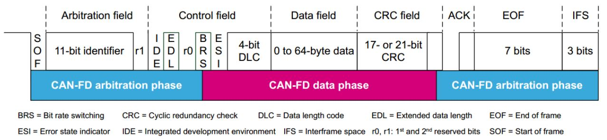
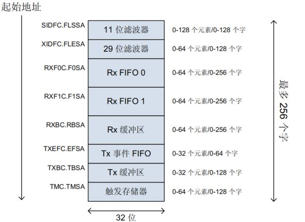
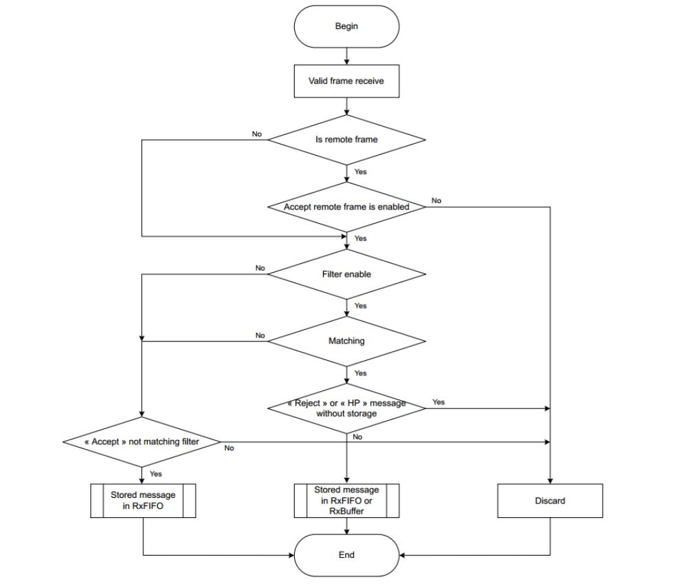
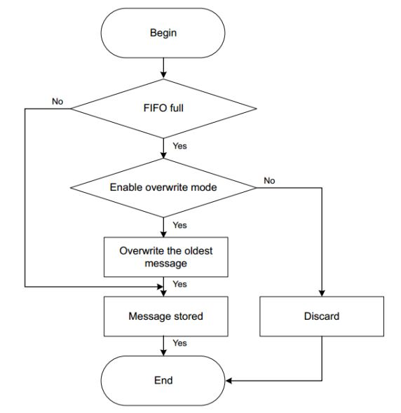
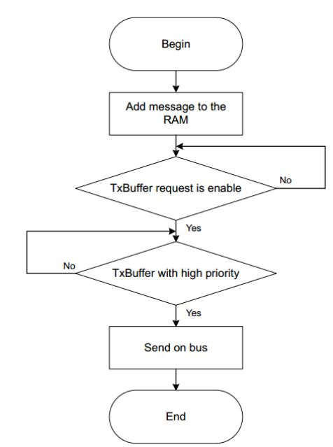
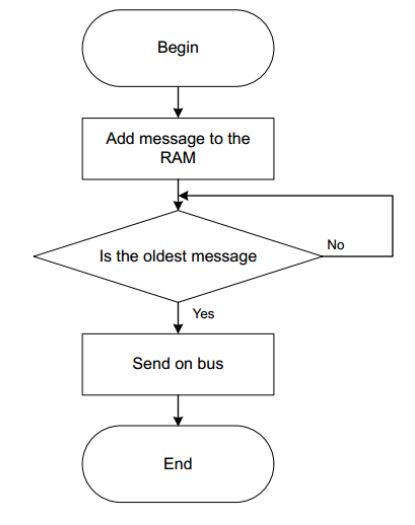
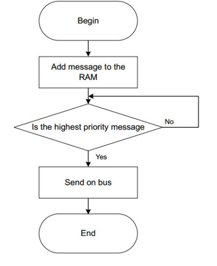
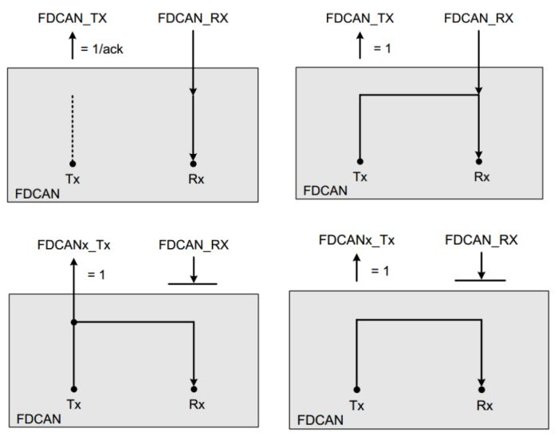

# STM32H7 11_FDCAN

## 1. STM32H7 FDCAN简介

### FDCAN 协议



- FDCAN 新增了 EDL , BRS , ESI 位，均在控制段中。

> - EDL：表示是 CAN 报文还是 CAN-FD 报文。
> - BRS：表示位速率转换，该位隐性时，速率可变（即BSR到CRC使用转换速率传输），该位为显性时，以正常的CAN-FD总线速率传输（恒定速率）。CAN FD采用了两种位速率：从控制段中的BRS位到ACK场之前（含CRC分界符）为可变速率，其余部分为原CAN总线用的速率，即仲裁段和数据控制段使用标准的通信波特率，而数据传输段时就会切换到更高的通信波特率。两种速率各有一套位时间定义寄存器，它们除了采用不同的位时间单位tq外，位时间各段的分配比例也可不同。
> - ESI：指示节点处于错误活动模式还是错误被动模式。

- FDCAN 协议速率可变，仲裁比特率最高 1Mbps（与CAN相同），数据比特率最高8Mbps，CAN-FD的传输格式如下图所示。
- FDCAN 标准帧ID长度可扩展到 12bit。

- CRC 校验加强

> - 为了避免位填充对CRC的影响，CAN FD在CRC场中增加了stuff count记录填充位的个数对应8的模，并用Grey Code表示，还增加了奇偶校验位。FSB（fixed stuff-bit）固定为前一位的补码。
>
> > Stuff Count由以下两个元素组成：
> >
> > 1. 格雷码计算：CRC区域之前的填充位数除以8，得到的余数进行格雷码计算得到的值（Bit0-2）。
> >
> >2. 奇偶校验：通过格雷码计算后的值的奇偶校验。
>
> - 为了保证信息发送的质量，CAN FD的CRC计算不仅要包括数据段的位，还包括来自SOF的Stuff Count和填充位。通过比较CRC的计算结果，可以判断接收节点是否能够正常接收。此时 CRC 位增加到 21 位。
>
> - 位填充：与CAN一样，填充位插入到SOF和数据场的末尾之间。插入的填充位数值是经过格雷码计算转换后的值，并且用奇偶校验位保护（Stuff Count）。在CRC校验场中，填充位被放置在固定的位位置，这称为固定填充位（Fixed Stuff Bit FSB）。固定填充位的值是上一位的反码。
>

### FDCAN  Message RAM

- STM32H7 自带了 10K 的消息 RAM，消息 RAM 的配置用来实现以下功能：

> 1. 过滤器
> 2. 接收 FIFO
> 3. 接收 BUFF
> 4. 发送事件 FIFO
> 5. 发送 BUFF
> 6. TTCAN
>
> > 系统 **不会** 对 Message RAM 配置进行检查。Message RAM 在 FDCAN1 和 FDCAN2 模块之间共用,，用户在配置的时候需要注意，如果配置错误将会导致发生异常情况。



|寄存器	|功能	|元素大小	|描述
-|-|-|-
|SIDFC.FLSSA	|最大支持128个元素	|最多占用 128个 word	|11 bit 标准帧滤波器设置
|XIDFC.FLESA	|最大支持64个元素	|最多占用 128 个 word	|29 bit 扩展帧滤波器设置
|RXF0C.F0SA	|最大支持64个元素	|最多占用 1152 个 word	|RX FIFO0 的设置
|RXF1C.F1SA	|最大支持64个元素	|最多占用 1152 个 word	|RX FIFO1 的设置
|RXBC.RBSA	|最大支持64个元素	|最多占用 1152 个 word	|RX BUFF 的设置
|TXEFC.EFSA	|最大支持32个元素	|最多占用 64 个 word	|TX EVENT FIFO 的设置
|TXBC.TBSA	|最大支持32个元素	|最多占用 576 个 word	|TX BUFF 的设置
|TMC.TMSA	|最大支持64个元素	|最多占用 128 个 word	|TT CAN 的设置

#### Message RAM 的配置

Message RAM 的大小是 10K Bytes,也就是 2560 个 word。如果都按照最大的配置去计算则会超出 Message RAM 的可配置范围。

Message RAM 配置结构体成员如下：

```c
  uint32_t MessageRAMOffset;             /*!< Specifies the message RAM start address.
                                              This parameter must be a number between 0 and 2560           */

  uint32_t StdFiltersNbr;                /*!< Specifies the number of standard Message ID filters.
                                              This parameter must be a number between 0 and 128            */

  uint32_t ExtFiltersNbr;                /*!< Specifies the number of extended Message ID filters.
                                              This parameter must be a number between 0 and 64             */

  uint32_t RxFifo0ElmtsNbr;              /*!< Specifies the number of Rx FIFO0 Elements.
                                              This parameter must be a number between 0 and 64             */

  uint32_t RxFifo0ElmtSize;              /*!< Specifies the Data Field Size in an Rx FIFO 0 element.
                                              This parameter can be a value of @ref FDCAN_data_field_size  */

  uint32_t RxFifo1ElmtsNbr;              /*!< Specifies the number of Rx FIFO 1 Elements.
                                              This parameter must be a number between 0 and 64             */

  uint32_t RxFifo1ElmtSize;              /*!< Specifies the Data Field Size in an Rx FIFO 1 element.
                                              This parameter can be a value of @ref FDCAN_data_field_size  */

  uint32_t RxBuffersNbr;                 /*!< Specifies the number of Dedicated Rx Buffer elements.
                                              This parameter must be a number between 0 and 64             */

  uint32_t RxBufferSize;                 /*!< Specifies the Data Field Size in an Rx Buffer element.
                                              This parameter can be a value of @ref FDCAN_data_field_size  */

  uint32_t TxEventsNbr;                  /*!< Specifies the number of Tx Event FIFO elements.
                                              This parameter must be a number between 0 and 32             */

  uint32_t TxBuffersNbr;                 /*!< Specifies the number of Dedicated Tx Buffers.
                                              This parameter must be a number between 0 and 32             */

  uint32_t TxFifoQueueElmtsNbr;          /*!< Specifies the number of Tx Buffers used for Tx FIFO/Queue.
                                              This parameter must be a number between 0 and 32             */

  uint32_t TxFifoQueueMode;              /*!< Tx FIFO/Queue Mode selection.
                                              This parameter can be a value of @ref FDCAN_txFifoQueue_Mode */

  uint32_t TxElmtSize;                   /*!< Specifies the Data Field Size in a Tx Element.
                                              This parameter can be a value of @ref FDCAN_data_field_size  */
```

Message RAM 配置	|STM32 FDCAN 结构体成员	|配置举例	|RAM 占用（word）
-|-|-|-
SIDFC.FLSSA（11 bit 标准帧滤波器配置）	|`StdFiltersNbr`	|1（设置 1 个标准帧滤波器）	|1
XIDFC.FLESA（29 bit 标准帧滤波器配置）	|`ExtFiltersNbr`	|1（设置 1 个扩展帧滤波器）|	2
RXF0C.F0SA（RX FIFO0 的设置）	|`RxFifo0ElmtsNbr * RxFifo0ElmtSize`（可设置的大小是 8 ，12，16，20，24，32，48，64）	|10（深度为 10 的 RX FIFO0）* 18（每帧长度是 64 个字节）	|180
RXF1C.F1SA（RX FIFO1 的设置）|	`RxFifo1ElmtsNbr * RxFifo1ElmtSize`（可设置的大小是 8 ，12，16，20，24，32，48，64）	|10（深度为 10 的 RX FIFO0）* 18（每帧长度是 64 个字节）	|180
RXBC.RBSA（RX BUFF 的设置）	|`RxBuffersNbr * RxBufferSize`(可设置的大小是 8 ，12，16，20，24，32，48，64）	|10（ 10 个 专用RX BUFF）* 18（每帧长度是 64 个字节）	|180
TXEFC.EFSA（TX EVENT FIFO 的设置）	|`TxEventsNbr`	|1	|2
TXBC.TBSA （TX BUFF 的设置）	|`TxBuffersNbr * TxElmtSize` + `TxFifoQueueElmtsNbr * TxElmtSize`	|5 * 18（每帧长度是 64 个字节）+ 5 * 18	|180
TMC.TMSA（TT CAN 的设置）	|无	|-	|0

（HAL库会对此配置进行严格检查）

#### FDCAN Filter

FDCAN 外设可以配置两套验收滤波器：一套用于标准标识符，一种是扩展标识符，用于存储或拒绝接收到的消息。可以将这些过滤器分配给 Rx FIFO 0/1 或专用的 Rx buffers。 FDCAN 执行接受过滤，它总是从过滤器 0 开始，然后遍历过滤器列表以找到匹配项元素。验收过滤在第一个匹配元素处停止，而随后的过滤元素不在针对此消息进行检索。因此，配置过滤器元素的顺序对过滤性能有很重要的影响。用户选择启用或禁用每个过滤器元素，并可以配置每个元素以接受或拒绝过滤。

每个过滤器元素可以配置为：

> - 范围过滤器（Range filter）：该过滤器匹配标识符在两个 ID 定义的范围内的所有消息。
>
> - 专用 ID 的过滤器（Filter for dedicated IDs）：可以将过滤器配置为匹配一个或两个特定的标识符。(列表模式)
>
> - 经典位屏蔽过滤器（Classic bit mask filter）：通过对接收到的标识符的位进行屏蔽来匹配标识符组。第一个 ID 配置为消息 ID 过滤器，第二个 ID 为过滤器屏蔽。过滤器屏蔽的每个零位屏蔽已配置的 ID过滤器的相应位位置。(掩码模式)



#### FDCAN Rx

可以在 CAN 消息 RAM 中配置两个 Rx FIFO。 每个 Rx FIFO 部分最多可存储 64 个元素。每个元素存储在一个 Rx FIFO 元素中。

- Rx FIFO 的起始地址是第一个 Rx FIFO 元素的第一个字的地址。收到的元素通过匹配过滤的数据将根据匹配的过滤器元素存储在适当的 Rx FIFO 中。如果 Rx FIFO 已满，则可以根据两种不同模式来处理新到达的元素：

  > 阻塞模式：这是 Rx FIFO 的默认操作模式，没有其他元素写入 RxFIFO，直到至少一个元素已被读出。
>
  > 覆盖模式：Rx FIFO 中接受的新元素将覆盖 Rx FIFO 中最旧（最先接收的数据）的元素并且 FIFO 的 put 和 get 索引加 1。

- 要从 Rx FIFO 读取元素，CPU 必须执行以下步骤：

  > - 读取寄存器 FDCAN_RXF1S 以了解 Rx FIFO 的状态。
  >
  > - 计算 RAM 中最旧的元素的地址。
  > - 从计算出的地址中读取元素。CPU 从 Rx FIFO 读取一个元素或一系列元素后，它必须确认读取。确认后，FDCAN 可以将相应的Rx FIFO 缓冲区重新用于新元素。为了确认一个或多个元素，则 CPU 必须将从 Rx FIFO 读取的最后一个元素的缓冲区索引写入 FDCAN_RXF1A 寄存器。结果，FDCAN 更新了 FIFO 填充级别和 get 索引。



- FDCAN 支持多达 64 个专用 Rx buffers。每个专用的 Rx buffers 可以存储一个元素。当将元素存储在专用 Rx 缓冲区中时，FDCAN 通过 FDCAN_IR 寄存器的 DRX 位设置中断标志以及新数据标志 FDCAN_NDAT1或FDCAN_NDAT2寄存器中的相应位。当FDCAN_NDAT1 / 2中的位置1时，相应的 Rx 缓冲区将被锁定（不会被新元素覆盖），并且相应的过滤器不匹配。 读取元素后，CPU 必须将相应的位复位 FDCAN_NDAT1 / 2，以解锁相应的 Rx 缓冲区。

#### FDCAN Tx

FDCAN 提供发送 event FIFO。 该 Tx event FIFO 的使用是可选的。 FDCAN 在 CAN 总线上传输了一个元素成功后，它可以将消息 ID 和时间戳存储在 Tx event FIFO 中元素。 Tx event FIFO 元素是一种数据结构，用于存储已传输消息。

为了将 Tx event 链接到 Tx event FIFO 元素，将来自已发送 Tx buffer 的消息标记复制到 Tx event FIFO 元素。

仅当 Tx buffer 元素中的 EFC 位（存储 Tx 事件）等于 1 时，事件才存储在 Tx event FIFO 中。当 Tx event FIFO 已满时，不会再有其他元素写入 Tx event FIFO，直到至少有一个元素被写入为止。读出后，Tx event FIFO 获取索引增加。如果在 Tx event FIFO 已满时发生 Tx event，则这事件被丢弃。**为避免 Tx event FIFO 溢出，可以使用 Tx event FIFO WaterMark**。

- 为了使外设传输元素，该元素在定义的存储空间内，并且传输开始。 传输的元素存储在 Tx buffer中，用户可以选择使用的机制：专用的 Tx buffer 或 Tx queue 或 Tx FIFO。FDCAN 最多支持 32 个元素。每个元素存储标识符，DLC，控制位（ESI，XTD，RTR，BRS，FDF），数据字段，位字段消息标记和事件 FIFO 控制位，仅一条消息。

- 在 RAM 上的分配按以下顺序进行：如果应用程序使用了专用的 Tx buffer，则它们在 Tx FIFO 和 Tx queue 之前分配。 用户只能在同一队列中选择 Tx queue 或 Tx FIFO 应用程序，FDCAN 不支持它们的组合。



- Tx FIFO 机制如下：



- Tx Queue 机制如下：



### FDCAN 测试模式

在 FDCAN 的操作模式下，除了正常操作外，还有几种测试模式可用。 那里测试模式只能用于生产测试或自测以及校准单元。必须将 FDCAN_CCCR 中的 TEST 位设置为 1，以允许对 FDCAN 测试寄存器和存储器的写访问。测试模式和功能的配置。FDCAN 以下列模式之一工作：

> - 限制操作模式 Restricted-operation mode
> - 总线监控模式 Bus-monitoring mode
> - 外部环回模式 External loop-back mode
> - 内部环回模式 Internal loop-back mode



## 2. STM32H7 FDCAN HAL库函数

