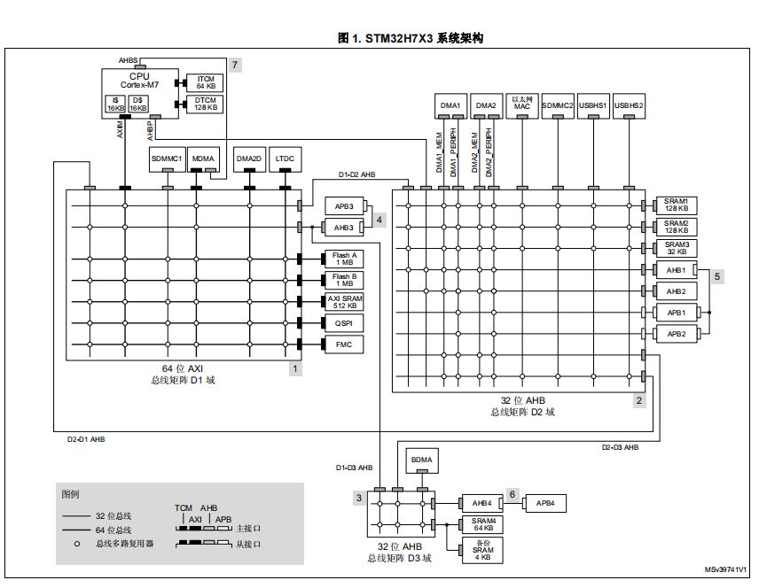
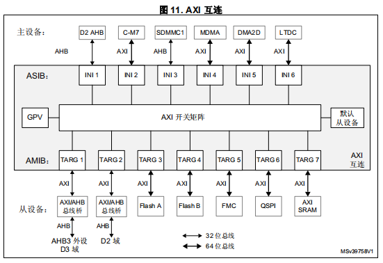
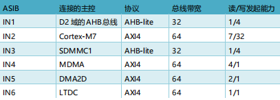
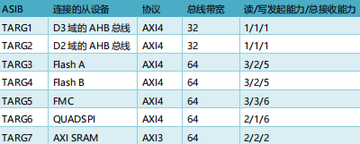
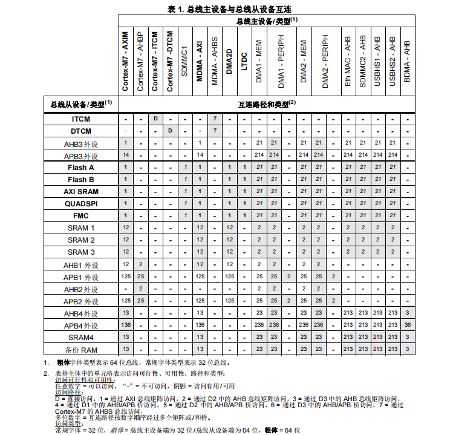

# STM32H7 1_总体架构

**注意：本系列笔记以STM32H743VIT6为核心板，其余STM32H7系列MCU在配置上会略有区别，具体使用请配合数据手册。**

**STM32H7和STM32F1，STM32F4的区别**

> -  H7 多了一个 L1 Cache 一级缓存，这个缓存在为低速存储器带来加速的同时，也为程序设计带来了一些问题，其中最为主要的是数据一致性问题。
> - 换了 ADC，DMA，USART 等重要外设，性能比之前要强劲很多。比如 ADC 换成了 3.6Msps 16 位分辨率，DMA 支持任意互联了，USART 也支持波特率自适应。
> - ST 官方仅提供了 HAL 库，没有再提供标准库。

## 1. STM32H7 总体架构

总线所外挂的外设，共分为三个域：`D1 Domain`，`D2 Domain` 和 `D3 Domain`。

1. `D1 Domain`

D1 域中的各个外设是挂在 64 位 AXI 总线组成 6*8 的矩阵上。

> - 6 个从接口端 ASIB1 到 ASIB6，外接的主控是 LTDC，DMA2D，MDMA，SDMMC1，AXIM 和 D2-to-D1 AHB 总线。
> - 7 个主接口端 AMIB1 到 AMIB7，外接的从设备是 AHB3 总线，Flash A，Flash B，FMC 总线，QSPI 和 AXI SRAM。另外 AHB3 也是由 AXI 总线分支出来的，然后再由 AHB3 分支出 APB3 总线。

2. `D2 Domain`

D2 域的各个外设是挂在 32 位 AHB 总线组成 9*8 的矩阵上。

> - 10 个从接口外接的主控是 D1-to-D2 AHB 总线，AHBP 总线，DMA1，DMA2，Ethernet MAC，SDMMC2，USB HS1 和 USB HS2。
> - 9 个主接口外接的从设备是 SRAM1，SRAM2，SRAM3，AHB1，AHB2，APB1，APB2，D2-to-D1 AHB 总线和 D2-to-D3 AHB 总线。

3. `D3 Domain`

D3 域的各个外设是挂在 32 位 AHB 总线组成 3*2 的矩阵上。

> - 3 个从接口外接的主控 D1-to-D3 AHB 总线，D2-to-D3 AHB 总线和 BDMA。
> - 2 个主接口外接的从设备是 AHB4，SRAM4 和 Bckp SRAM。另外 AHB4 也是这个总线矩阵分支出来的，然后再由 AHB4 分支出 APB4 总线。

## 2. STM32H7 AXI总线（D1）

AXI 总线有 6 个从接口 ASIBs（AMBA slave interface blocks）和 7 个主控接口 AMIBs（AMBA master interface blocks）。

> 读写发起能力说明可以同时存在多路读写信号。

## 3. STM32H7 总线桥

## 4. STM32H7 RAM 

**TCM区**

TCM : Tightly-Coupled Memory 紧密耦合内存 。

- ITCM 用于运行指令，也就是程序代码；地址 `0x00000000` -`0x0000FFFF`，大小 64KB。

- DTCM 用于数据存取，特点是跟内核速度一样，而片上 RAM 的速度基本都达不到这个速度，所以有降频处理。地址 `0x20000000` - `0x2001FFFF`，大小 128KB。

**AXI SRAM**

位于 D1 域，数据带宽是 64bit，挂在 AXI 总线上。除了 D3 域中的 BDMB 主控不能访问，其它都可以访问此 RAM 区。

地址 `0x24000000` - `0x2407FFFF`，大小 512KB。

用途不限，可以用于用户应用数据存储或者 LCD 显存。

**SRAM1，SRAM2，SRAM3**

位于 D2 域，数据带宽是 32bit，挂在AHB 总线上。除了 D3域中的 BDMA 主控不能访问这三块SRAM，其它都可以访问这几个 RAM 区。

SRAM1：`0x30000000` - `0x3001FFFF`，大小128KB。可用于 D2 域中的 DMA 缓冲，也可以当 D1 域断电后用于运行程序代码。

SRAM2：`0x30020000` - `0x3003FFFF`，大小128KB。可用于 D2 域中的 DMA 缓冲，也可以用于用户数据存取。

SRAM3：`0x30040000`-`0x30047FFF`，大小 32KB，用途不限，主要用于以太网和 USB 的缓冲。

**SRAM4**

位于 D3 域，数据带宽是 32bit，挂在 AHB 总线上，大部分主控都能访这块 SRAM 区。

地址 `0x38000000` - `0x38003FFF`，大小256KB。

用途不限，可以用于 D3 域中的 DMA 缓冲，也可以当 D1 和 D2 域进入 DStandby 待机方式后，继续保存用户数据。

**Backup SRAM**

备份 RAM 区，位于 D3 域，数据带宽是 32bit，挂在 AHB 总线上，大部分主控都能访问这块 SRAM 区。

地址 `0x38800000` - `0x3800FFFF`，大小32KB。

用途不限，主要用于系统进入低功耗模式后，继续保存数据（Vbat 引脚外接电池）。

- RAM 使用的注意事项：

> 1. AXI SRAM，SRAM4，ITCM 和 DTCM 可以在上电后直接使用。而 SRAM1，SRAM2 需要使能。
> 2. DTCM 和 ITCM 不支持 DMA1，DMA2 和 BDMA，仅支持 MDMA。
>    AXI SRAM，SRAM1，SRAM2 不支持 BDMA，支持 MDMA，DMA1 和 DMA2。
>    SRAM4 支持所有 DMA，即 MDMA，DMA1，DMA2 和 BDMA。

- 推荐的 RAM 分配方案：**主 RAM 空间采用 TCM，而其它需要大 RAM 或者 DMA 的场合，使用剩余 RAM 空间。**

