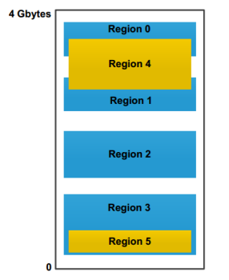
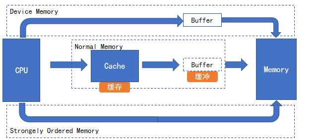
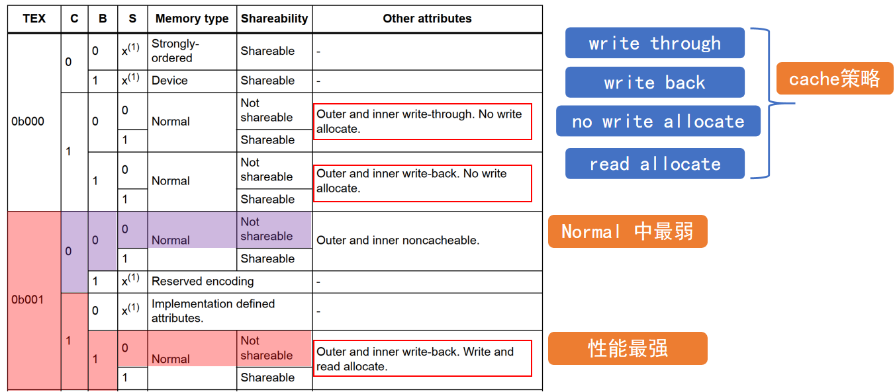
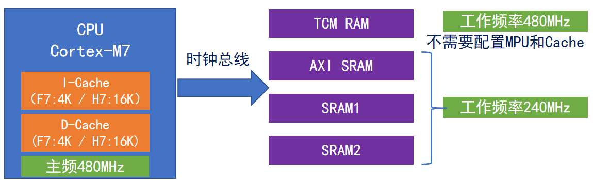
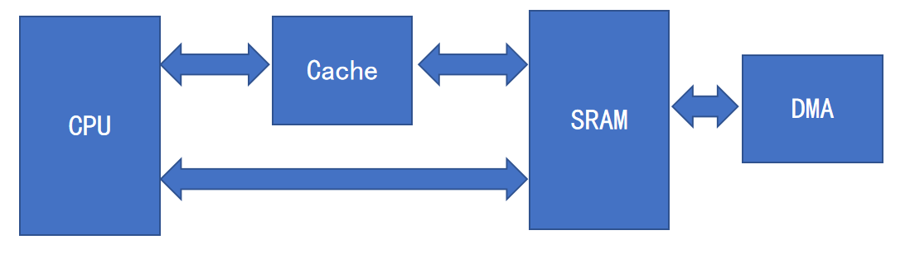
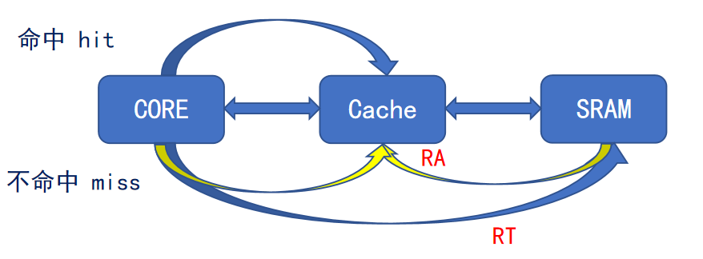
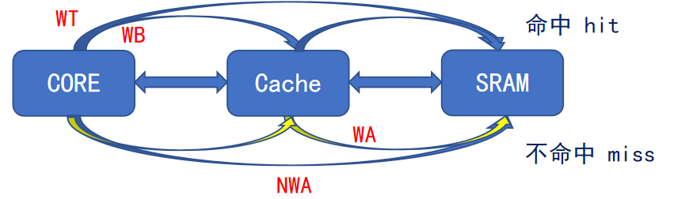

# STM32H7 2_Cache MPU

## 1. MPU 简介

MPU 即为内存保护单元，用于设置不同存储区域的存储器访问权限（特权级、用户级）和存储器(内存和外设)属性（可缓存、可缓冲、可共享）。

> - 阻止用户应用程序破坏操作系统使用的数据；
> - 阻止一个任务访问其他任务的数据区，从而隔离任务；
> - 把关键数据区域设置为只读，从根本上解决被破坏的可能；
> - 检测意外的存储访问，如堆栈溢出、数组越界等；
> - 将SRAM或RAM空间定义为不可执行，防止代码注入攻击。

MPU 可以配置保护 16 个内存区域（这 16 个内存域是独立配置的），每个区域最小要求 256 字节，每个区域还可以配置为 8 个子区域。由于子区域一般都相同大小，这样每个子区域的大小就是 32 字节。

MPU 可以配置的 16 个内存区的序号范围是 0 到 15，还有**默认区 default region，也叫作背景区，序号-1**。由于这些内存区可以嵌套和重叠，所以这些区域在嵌套或者重叠的时候有个优先级的问题。序号 15 的优先级最高，以此递减，序号-1，即背景区的优先级最低。这些优先级是固定的。**重叠或嵌套下，重叠部分按着优先级高的内存区配置规则执行**。

- 内存区域访问权限

| 宏定义                   | 含义                              |
| ------------------------ | --------------------------------- |
| `MPU_REGION_NO_ACCESS`   | 无访问（特权级&用户级都不可访问） |
| `MPU_REGION_PRIV_RW`     | 仅支持特权级读写访问              |
| `MPU_REGION_PRIV_RW_URO` | 禁止用户写访问（特权可读写访问）  |
| `MPU_REGION_FULL_ACCESS` | 全访问（特权级&用户级都可访问）   |
| `MPU_REGION_PRIV_RO`     | 仅支持特权读访问                  |
| `MPU_REGION_PRIV_RO_URO` | 只读（特权&用户都不可以写）       |

配置好MPU后，不得访问定义外的地址空间，也不得访问未经授权的区域，否则属于非法访问。

- 内存区域访问属性

1. `Normal memory`(ROM、FLASH、SRAM)：CPU以最高效的方式加载和存储字节、半字和字， CPU对于这种内存区的加载或存储不一定要按照程序代码的顺序执行。

2. `Device memory`(外设)：加载和存储要严格按照次序进行，确保寄存器按照正确顺序设置。
3. `Strongly ordered memory`：程序完全按照代码顺序执行，CPU会等待当前加载存储执行完毕后才执行下一条指令，导致性能下降。

> - 可缓存：是否启用 Cache；
> - 可缓冲：是否启用 Buffer；
> - 可共享：每条总线上都有多个Master和Slave，且同一个Slave可以多个Master进行访问，**共享用于 Master 间数据同步**。**开启共享相当于关闭 Cache，读操作速度影响大，写操作基本没有影响。**

## 2. Cache 简介

Cache(高级缓存)是提升STM32性能的关键一步。M7内核芯片做了一级Cache支持，**Cache分为数据缓存 D-Cache 和指令缓存 I-Cache。**

Cache支持4种基本操作：**使能，禁止，清空，无效化。**

> 数据缓存 D-Cache 是解决 CPU 加速访问 SRAM。

- **Cache 操作**

> 图中显示了对SRAM内的数据的操作方式：
>
> 1. CPU 直接操作 SRAM；
> 2. CPU 通过 Cache 操作 SRAM；
> 3. DMA 操作 SRAM。

**读操作**：CPU要读取的SRAM区数据在Cache中已经加载好，叫读命中(Cache hit)； 如果Cache里面没有，这就是读Cache Miss。

**写操作**：CPU要写的SRAM区数据在Cache中已经开辟了对应的区域，这就叫写命中(Cache hit)；如果Cache里面没有开辟对应的区域，这就是写Cache Miss。

保证Cache有足够高的命中率，尽量少的Cache miss，读/写速度会有比较大的提高。

> 当 CPU 读取 Cache 时：
>
> - 如果 Cache hit，则直接从Cache中读出数据即可；
> - 如果 Cache miss，如果配置为 read through 策略，则直接从 SRAM 中读取数据；如果配置为 read allocate 策略，则先加载在 Cache 中，再读取 Cache。

> 当 CPU 读取 Cache 时：
>
> - 如果 Cache hit，如果配置为 write through 策略，则直接写到内存中并同时放到Cache 里面。如果配置为 write back 策略，则数据更新时只写入 Cache，只在数据被替换出 Cache 时，被修改的 Cache 数据才会写入内存。
> - 如果 Cache miss，如果配置为 write allocate 策略，则先把要写的数据载入到Cache，对 Cache 写后，更新到内存；如果配置为 no write allocate 策略，则直接写入内存，不用 Cache。

- 数据不一致问题解决

1. 设置共享属性，相当于关闭 Cache；

2. Cache 维护：

   > - Cache已变化，SRAM 数据未更新：DMA搬运数据前，将 Cache 相对应数据更新到SRAM。(`SCB_CleanDCache `/ `SCB_CleanInvalidateDCache`)；
   > - SRAM数据已变化，Cache 未更新：DMA搬运数据后，cache数据无效，需从SRAM中获取。(`SCB_InvalidateDCache` / `SCB_CleanInvalidateDCache`)。
